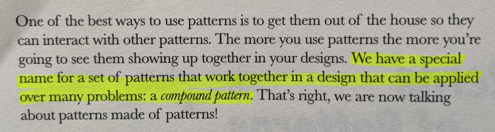
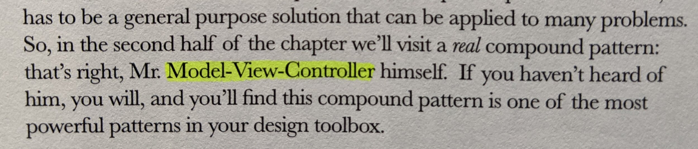

Since the beginning of my coding journey, I've heard terms such as MVC and MVVM, associated with the words "architecture" and "design pattern". In trying to get a deeper understanding of these I decided to go in search of a definition for software architecture and had difficulty finding a clear answer. With that said, I'd like to walk you through my research as well as my perspective from a beginner's mind.

<blockquote class="twitter-tweet">
Me researching software architecture and going down the deepest of rabbit holes 😂 <a href="https://t.co/H3d2gjXEVr">pic.twitter.com/H3d2gjXEVr</a>
— Daniel (@danpgomez) <a href="https://twitter.com/danpgomez/status/1374489560164438018?ref_src=twsrc%5Etfw">March 23, 2021</a></blockquote>

I first found a great YouTube channel called [A Dev Story](https://www.youtube.com/channel/UCGjZSsyZY1hce8SsGV1_IHg) which offers the great playlist below covering software architecture fundamentals. It provided a great general overview of the process of defining the architecture of a project based on its requirements, scalability, maintainability, and performance.

<iframe class="embedly-embed" src="//cdn.embedly.com/widgets/media.html?src=http%3A%2F%2Fwww.youtube.com%2Fembed%2Fvideoseries%3Flist%3DPL4JxLacgYgqTgS8qQPC17fM-NWMTr5GW6&amp;display_name=YouTube&amp;url=https%3A%2F%2Fwww.youtube.com%2Fplaylist%3Flist%3DPL4JxLacgYgqTgS8qQPC17fM-NWMTr5GW6&amp;image=https%3A%2F%2Fi.ytimg.com%2Fvi%2F8UlLgOf20Ho%2Fhqdefault.jpg%3Fsqp%3D-oaymwEWCKgBEF5IWvKriqkDCQgBFQAAiEIYAQ%3D%3D%26rs%3DAOn4CLAofVI40K8LYycCSFEbsb7D2aj64w%26days_since_epoch%3D18710&amp;key=61d05c9d54e8455ea7a9677c366be814&amp;type=text%2Fhtml&amp;schema=youtube" width="853" height="480" scrolling="no" title="YouTube embed" frameborder="0" allow="autoplay; fullscreen" allowfullscreen="true"></iframe>

After watching this playlist, I learned that with software architecture you:

- "Focus on the main structure rather than the implementation details"
- "Anticipate expensive choices"
- "Make explicit the core concepts that allow the software to have high quality"

Ok so now I understood architecture a bit more, but needed to know how it differed from software design, and how patterns like MVVM came into the picture. I continued my search and found a [great architecture guide](https://martinfowler.com/architecture/) by a name I'd seen in a few books on the desks of fellow developers: Martin Fowler. Now I was getting somewhere! This guide provided great context for how to think about architecture and its importance. Take a look at Fowler's speech from OSCON 2015.

<iframe class="embedly-embed" src="//cdn.embedly.com/widgets/media.html?src=https%3A%2F%2Fwww.youtube.com%2Fembed%2FDngAZyWMGR0%3Ffeature%3Doembed&amp;display_name=YouTube&amp;url=https%3A%2F%2Fwww.youtube.com%2Fwatch%3Fv%3DDngAZyWMGR0&amp;image=https%3A%2F%2Fi.ytimg.com%2Fvi%2FDngAZyWMGR0%2Fhqdefault.jpg&amp;key=61d05c9d54e8455ea7a9677c366be814&amp;type=text%2Fhtml&amp;schema=youtube" width="854" height="480" scrolling="no" title="YouTube embed" frameborder="0" allow="autoplay; fullscreen" allowfullscreen="true"></iframe>

In his speech Fowler uses the following quote to define software architecture:

> “The important stuff (whatever that is).” - Ralph Johnson

Great! I think I get it now! Software architecture seems to be about agreeing on the things that will be difficult to change later. But again how does that differ from software design or "design patterns" even? Going deeper down the rabbit hole I landed on [this very thorough and interesting article.](https://medium.com/@concisesoftware/whats-the-difference-between-software-architecture-and-design-b705c2584631) Here's a paragraph that stood out to me:

> Software architecture shows the system’s structure and hides the implementation details, focusing on how the system components interact with one another. Software design, on the other hand, concentrates on the system’s implementation, often delving into considerable detail. Software design centers on the selection of algorithms and data structures, as well as the implementation details of every single component. As expected, the concerns of software design and architecture tend to overlap. But instead of losing energy on defining rules for distinguishing them, it’s smarter to treat them as two parts of one process.

 

<iframe class="embedly-embed" src="//cdn.embedly.com/widgets/media.html?src=https%3A%2F%2Fgiphy.com%2Fembed%2FuPnKU86sFa2fm%2Ftwitter%2Fiframe&amp;display_name=Giphy&amp;url=https%3A%2F%2Fmedia.giphy.com%2Fmedia%2FuPnKU86sFa2fm%2Fgiphy.gif&amp;image=https%3A%2F%2Fi.giphy.com%2Fmedia%2FuPnKU86sFa2fm%2Fgiphy.gif&amp;key=61d05c9d54e8455ea7a9677c366be814&amp;type=text%2Fhtml&amp;schema=giphy&amp;wmode=opaque" width="435" height="290" scrolling="no" title="Giphy embed" frameborder="0" allow="autoplay; fullscreen" allowfullscreen="true"></iframe>

 

Bingo! The two concepts overlap in some areas and they're "two parts of one process." This was starting to make more sense now. I was still looking to connect one last piece of the puzzle: design patterns. I'd recently purchased a copy of Head First Design Patterns by Eric Freeman and Elisabeth Robson (older edition) and had already taken the [LinkedIn Learning Course](https://www.linkedin.com/learning-login/share?forceAccount=false&redirect=https%3A%2F%2Fwww.linkedin.com%2Flearning%2Fprogramming-foundations-design-patterns-2%3Ftrk%3Dshare_ent_url%26shareId%3DXwerVBIxRvOeHsmTM%252B1uKg%253D%253D&account=2138953) by the authors of the book. I haven't finished reading the book yet, but I did find a mention of the Model-View-Controller pattern in a chapter titled "Compound Patterns".

Towards the end of the book (pg. 604 if you're interested) MVC is also referred to as an "application pattern." I see. So these Model-View-XYZ patterns can be described as both "architecture" or "design" patterns and are used to solve common problems when building applications. Sweet! Additionally, since one of my goals with this process is to learn more about Android architecture patterns specifically, I decided to add that as my search term and found [another great article](https://thoughtbot.com/blog/android-architecture-comparison-mvp-vs-mvvm) with a more specific definition.

> Architecture patterns are established designs and ways of structuring an application in order to minimize bugs, make code easier to read, understand, and test.

Lastly while writing this post I found [this neat page](https://beza1e1.tuxen.de/definitions_software_architecture.html) which gave me the encouraging feeling that I was not alone in my original confusion of this topic 😆.

## Conclusion

Alright, this is the moment you've probably been waiting for. No pressure right. Let's take a look at the original questions I had.

- What is Software Architecture?
- How does it differ from Software Design?
- Where do patterns like MVVM and MVI come into the picture?

My conclusion is this: Software architecture is about the big picture, and foundational structure of an application. Moreover it pertains to the things that must be decided and agreed upon early in the development process to make software more maintainable, scalable, performant, and avoid a costly, difficult, and time consuming restructuring later on. Software design is closely related but gets more specific about the implementation or "how" you will actually solve the architecture requirements. And patterns like MVVM and MVI are compound pattern solutions to be used to solve application architecture and design problems.

Do you agree? Did I miss anything? Please let me know in the comments. I definitely think I have a long road ahead before I can be like Neo and see/understand the full Matrix but I have a lot more clarity now. Thank you for reading!

 

<iframe class="embedly-embed" src="//cdn.embedly.com/widgets/media.html?src=https%3A%2F%2Fgiphy.com%2Fembed%2FYAEaaxNsUKoNfoQKtm%2Ftwitter%2Fiframe&amp;display_name=Giphy&amp;url=https%3A%2F%2Fmedia.giphy.com%2Fmedia%2FYAEaaxNsUKoNfoQKtm%2Fgiphy.gif&amp;image=https%3A%2F%2Fi.giphy.com%2Fmedia%2FYAEaaxNsUKoNfoQKtm%2Fgiphy.gif&amp;key=61d05c9d54e8455ea7a9677c366be814&amp;type=text%2Fhtml&amp;schema=giphy&amp;wmode=opaque" width="435" height="244" scrolling="no" title="Giphy embed" frameborder="0" allow="autoplay; fullscreen" allowfullscreen="true"></iframe>
