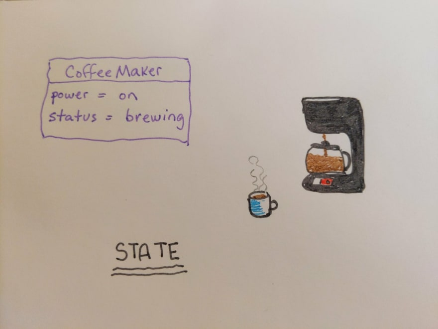

I often hear the term "state" being used when describing objects in a program, or even programs entirely, and decided to do a bit of research to get some clarity. I found [a few helpful](https://en.wikipedia.org/wiki/State_(computer_science)#:~:text=The%20contents%20of%20these%20memory,is%20called%20the%20program's%20state.&text=Imperative%20programming%20is%20a%20programming,which%20change%20the%20program%20state.(computer_science)#:~:text=The%20contents%20of%20these%20memory,is%20called%20the%20program's%20state.&text=Imperative%20programming%20is%20a%20programming,which%20change%20the%20program%20state.) [articles](https://www.quora.com/What-is-a-state-in-computer-science) and videos (see bottom of post) which brought me to the following conclusion: The concept of State in programming refers to the value of all variables that determine the status or condition of the program or object in question. With this in mind I came up with the following analogy of a coffee maker (somehow most things in my life revolve around coffee ☕️). So in the image below, the coffee maker's state is _"power = on"_ and _"status = brewing"._ Also important to note that state can change based on both internal or external events, such as the user turning off the coffee maker, or it finishing the brewing process.

<iframe width="560" height="315" src="https://www.youtube.com/embed/jRtdbSKWFqk" title="YouTube video player" frameborder="0" allow="accelerometer; autoplay; clipboard-write; encrypted-media; gyroscope; picture-in-picture; web-share" allowfullscreen></iframe>
